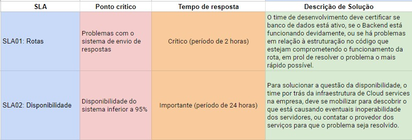

# Introdução

Este documento tem como objetivo relatar o plano de delivery e de sustentação do projeto. Para auxiliar na compreensão de ambos documentos, mas principalmente do plano de sustentação, foi também desenvolvido uma matriz RACI e um diagrama BPMN que relaciona as pessoas com o tratamento de incidentes.

# Sumário

- [Plano de Delivery de Software](#plano-de-delivery-de-software)
- [Plano de Sustentação de Software](#plano-de-sustentação-de-software)
- [Matriz RACI](#matriz-raci)
- [Diagrama BPMN](#diagrama-bpmn)

# Plano de Delivery de Software

**Nome do Projeto:** Trackinos
**Data de Início:** 30/01/2024
**Data de Entrega Prevista:** 11/04/2024
**Versão do Documento:** 1.0.0

## 1. Introdução

**Objetivo do ducmento:** o objetivo do plano de delivery de software é definir e detalhar as etapas, recursos e cronograma necessários para entregar um produto de software aos clientes. Ele inclui informações sobre o processo de desenvolvimento, testes, implantação e suporte pós-implantação, garantindo que o software seja entregue com qualidade, dentro do prazo e dentro do orçamento estabelecido.

**Escopo do projeto:** o projeto de automação de testes desenvolvido para a Track surge da necessidade de reduzir problemas relacionados  aos deploys manuais e reduzir a frequência de rollbacks. As funcionalidades incluídas estão testes automatizados  em pesquisas, dashboards, distribuição e interação, para reduzir a probabilidade de regressões durante os deploys e permitir a detecção precoce de problemas potenciais.

## 2. Equipe de projeto

**Orientador:** José Romualdo
**Instrutor:** Hermano Peixoto
**Desenvolvedores e testadores:**
- <a href="https://www.linkedin.com/in/abner-silva-barbosa-8a3542225/">Abner barbosa</a>
- <a href="https://www.linkedin.com/in/arthur-fraige/">Arthur Fraige</a>
- <a href="https://www.linkedin.com/in/yveslevi/">Yves Lapa</a>
- <a href="https://www.linkedin.com/in/raissa-sabino/">Raissa Sabino</a>
- <a href="https://www.linkedin.com/in/pedro-gattai-096678227/">Pedro  Gattai</a>
- <a href="https://www.linkedin.com/in/sofia-moreiras-pimazzoni/">Sofia Pimazzoni</a>
- <a href="https://www.linkedin.com/in/emanuelcosta2/">Emanuel Costa</a>

## 3. Cronograma de delivery (fases do projeto e marcos principais)

### Fase 1

**Marco principal:** 16/02/2024

O projeto foi dividido em 5 fases de entregas, a primeira fase a equipe se concentrou na identificação dos requisitos funcionais do sistema. Isso inclui a coleta de informações dos stakeholders e análise de documentos existentes, utilizando a abordagem do modelo C4 (Context, Containers, Components, Code), a equipe elaborou diagramas de arquitetura de nível 1 e 2 para visualizar a estrutura do sistema, foram criados protótipos de baixa fidelidade ou wireframes para visualizar a interface do usuário e a experiência de navegação do sistema,  foram elaborados planos detalhados de testes para garantir a qualidade e a robustez do sistema e por último foram elaborados planos detalhados de testes para garantir a qualidade e a robustez do sistema.

### Fase 2

**Marco Principal:** 01/03/2024

Na segunda fase a equipe concentrou-se na criação da interface do usuário da aplicação, desenvolvemos o Backend o foco estava na implementação da lógica de negócios da aplicação e na criação dos serviços e APIs necessários para que o frontend se conectar, foram definidos os testes da tdd, isso garante que o código atenda aos requisitos definidos pelos testes e que novos recursos não quebrem funcionalidades existentes, os casos de teste de unidade foram definidos com base nos requisitos de negócios e nas especificações técnicas do projeto, também foram feitas métricas de qualidade utilizadas para avaliar a qualidade do código-fonte e do produto final.

### Fase 3

**Marco Principal:** 15/03/2024

Na terceira fase executamos a implementação de análise estática do código nesta etapa, concentramo-nos na análise do código-fonte do projeto para identificar possíveis erros, inconsistências ou padrões de código que possam afetar negativamente a qualidade do software.Foi feito o teste caixa preta do frontend,  realizamos testes no frontend da aplicação sem ter acesso ao código-fonte interno e focamos na verificação da integração entre os diversos componentes do sistema.

### Fase 4

**Marco Principal:**  28/03/2024

Na quarta fase do projeto, concentramo-nos nos testes de carga e na implementação de um dashboard de monitoramento da aplicação. Essa etapa é crucial para garantir que a aplicação seja capaz de lidar com cargas de trabalho intensas e para fornecer insights valiosos sobre o desempenho e a estabilidade do sistema em ambiente de produção.

### Fase 5

**Marco Principal:** 11/04/2024

Na quinta e última fase do projeto, concentramos nossos esforços em três principais aspectos: planos de delivery, sustentação e refatoração final. Essas atividades são essenciais para garantir que o produto seja entregue com sucesso aos clientes, mantendo sua qualidade e relevância ao longo do tempo.

## 4. Metodologia

**Metodologia de desenvolvimento:** visto as diretrizes de trabalho da faculdade, e o escopo do projeto, nossa equipe desenvolveu o projeto utilizando a metodologia ágil, especificamente o scrum, com o fluxo de desenvolvimento sendo dividido em cinco sprints, cada uma com uma duração de duas semanas. Entrando mais a fundo em relação ao desenvolvimento, nossas sprints foram divididas na seguinte estrutura de tópicos, sprint 1 sendo a constituição de regras de negócio, definição de requisitos e prototipação do sistema, em seguida a sprint 2, tendo o desenvolvimento do frontend e backend do sistema, a sprint 3, sendo focada no desenvolvimento de testes e ajustes gerais no sistema, a sprint 4, no desenvolvimento de mais testes, visualização das métricas do sistema e mais ajustes gerais, por fim, a sprint 5, sendo focada em reajustar a documentação do projeto, e corrigir qualquer eventual pendência ou ponto de melhora. 

**Ferramentas de desenvolvimento e teste:** dentro do sistema temos ferramentas de testes diferentes para tipos de testes diferentes, dentre essas ferramentas, estão presentes:
- *Cypress*, para testes de interface (diversos componentes do frontend);
- *K6*, para testes de carga e de estresse customizáveis no backend;
- *Supertest*, para testes de integração do backend;
- *React testing library*, para testes de renderização dos componentes do frontend;
- *Prometheus*, para criar métricas que serão utilizadas para realizar a visualização e interpretação dos testes;
- *Grafana*, para visualizar as métricas definidas pelo Prometheus em uma interface gráfica;

## 5. Gestão de qualidade

**Estratégias de teste:** no processo de realização do projeto, era de expectativa dos tanto dos membros constituintes da equipe de desenvolvimento, quanto dos stakeholders, que fossem estabelecidas estratégias para testagem da aplicação de maneira eficaz. Nesse sentido, é esperado que o cliente, assim que receber o projeto busque por rodar os testes que nós já fizemos e explicitamos em outros tópicos do documento, como testes com Cypress, Grafana, k6, Jest, entre outros, como forma de comprovar que a aplicação está de fato funcionando. 

Nossas estratégias de testes se concentraram, majoritariamente, em:
- **Testes unitários:** Verificando a menor parte testável de um software, como funções ou métodos, para garantir que funcionem corretamente de forma isolada,
- **Testes de integração:** Com a estratégia de verificar como diferentes módulos ou serviços funcionam juntos, garantindo que a integração entre eles não cause problemas.
- **Testes de Carga:** Avaliar a capacidade do sistema de operar sob uma carga significativa, como um grande número de usuários simultâneos.
- **Testes de Estresse:** Determinar os limites do sistema submetendo-o a condições extremas e observar como ele se comporta sob estresse.

**Critérios de aceitação:** foram definidos alguns critérios de aceitação claros e objetivos que garatem que o software atenda às expectativas do cliente e do mercado. Dentre os critérios de aceitação, podemos definir: 
- Um percentual pré-definido do código, 80%, deve estar coberto por testes unitários;
- Todos os testes unitários devem ser concluídos com sucesso sem falhas;
- Todas as interfaces entre módulos devem funcionar como especificado, sem erros;
- A integração de módulos não deve resultar em perda ou corrupção de dados;
- O software deve ser capaz de se recuperar de falhas sem intervenção humana e sem perda de dados;

## 6. Gestão de rsicos

**Riscos potenciais do projeto:**
- Problemas de disponibilidade do whatsapp;
- Dar acesso à plataforma aos desenvolvedores e esse se perder em pouco tempo;
- A pipeline de testes falhar, por não estar bem configurada;
- Os testes no código falharem por conta de alguma mudança no código;
- O deploy do projeto não ser bem executado, afetando a disponibilidade da nossa aplicação;

**Plano de mitigação:**
- Ter um sistema de tentativas para enviar as pesquisas mesmo que o whatsapp esteja indisponível, para que quando whatsapp ficar disponível seja possível enviar as pesquisas;
- Garantir que o acesso dado a plataforma da Track.co aos desenvolvedores não seja perdido;
- Garantir no ambiente de testes/dev que a pipeline está funcionando de acordo com o esperado, ou seja, todos os testes programados em nosso código sejam executados sem erros;
- Garantir que sempre que houver uma mudança no código o teste dessa funcionalidade ou parte do código também seja atualizado;
- Garantir que a arquitetura e o deploy sejam executados e testados de maneira contínua para que o aplicação tenha uma alta disponibilidade;

## 7. Plano de comunicação

Todas as informações serão disponibilizadas pelo GitHub.
- **GitHub:** Utilizado como o repositório central para toda a documentação do projeto, incluindo descrição do projeto, arquitetura, atualizações de progresso e decisões importantes.

Documentos Disponibilizados:
- <a href="README.md">README.md</a>: descrição geral do projeto, incluindo objetivos, escopo e como navegar pelos documentos do repositório.
- <a href="docs\arquitetura.md">arquitetura.md</a>: Nesse arquivo, se encontra o processo de instalação de todas as dependências de instalação necessárias para executar o projeto, além do manual de execução para os diversos componentes presentes no mesmo.  
- <a href="docs\delivery.md">delivery.md</a>: Este arquivo apresenta o plano de delivery e de sustentação do projeto, que são essesnciais para que as expectativas do cliente estejam alinhadas com a entrega.
- <a href="docs\métricas.md">métricas.md</a>: Este arquivo apresenta as métricas de qualidade do projeto, que nada mais são do que medidas que auxiliam a garantir a qualidade do desenvolvimento do produto.
- <a href="docs\prototipacao.md">prototipacao.md</a>: Nesse arquivo se encontra todo o relatório do processo de prototipação do frontend, com a explicação do processo e acesso ao protótipo no Figma.
- <a href="docs\testes.md">testes.md</a>: Nesse arquivo se encontra o relatório com todos os testes realizados no projeto, os testes em questão avaliam diferentes componentes do projeto. O arquivo descreve as diversas tecnologias utilizadas para realizar testes, e apresentam prints de diversos resultados.

## 8. Implementação e deployment

### Ambientes de implementação

#### Desenvolvimento

**Descrição:** ambiente utilizado pelos desenvolvedores do projeto para criar e testar novas funcionalidades conforme especificado no plano inicial do projeto.
**Localização:** Máquinas individuais dos desenvolvedores.
**Acesso:** Restrito aos membros da equipe de desenvolvimento.

Neste ambiente, cada desenvolvedor possui uma máquina dedicada para a implementação de novas funcionalidades do projeto. Cada desenvolvedor tem acesso à aplicação em execução em sua própria máquina, o que permite um desenvolvimento independente e ágil. O acesso a este ambiente é restrito aos membros da equipe de desenvolvimento, garantindo a segurança e a confidencialidade do trabalho em andamento.

#### Teste

**Descrição:** ambiente utilizado para realizar os testes unitários,  integração, interface e de carga, em toda a aplicação, logo, frontend e backend e banco de dados.
**Localização:** servidor dedicado na AWS Academy para realizar esses testes de carga de forma escalável e simulando um ambiente semelhante com o de produção
**Acesso:** restrito aos desenvolvedores que criam novas funcionalidades e a time de Devops.

Nesse ambiente, os testes são conduzidos de forma abrangente, abrangendo desde testes unitários até testes de carga, para garantir a qualidade e a desempenho de toda a aplicação. Os testes são realizados tanto no frontend quanto no backend, incluindo interações com o banco de dados, garantindo a integridade e a funcionalidade do sistema como um todo.

O servidor dedicado na AWS Academy é selecionado para fornecer uma infraestrutura escalável, permitindo a execução de testes de carga em uma escala que simula um ambiente semelhante ao de produção. Isso é crucial para identificar e mitigar possíveis problemas de desempenho antes que o software seja implantado em produção.

O acesso a este ambiente é restrito aos desenvolvedores responsáveis pela criação de novas funcionalidades, bem como à equipe de DevOps, que desempenha um papel fundamental na configuração e manutenção da infraestrutura de teste. Essa restrição de acesso garante que apenas membros autorizados tenham permissão para realizar testes e interagir com o ambiente de teste, garantindo a segurança e a integridade dos dados e do sistema em geral.

#### Produção

**Descrição:** ambiente de produção onde o software estará disponível para uso pelos clientes finais, nesse caso as empresas que vão utilizar o nosso software como serviço.
**Localização:** servidor em data center certificado, nesse caso a AWS
**Acesso:** público para os usuários finais e desenvolvedores de alto nível.

Neste ambiente, o software estará completamente pronto e disponível para uso pelas empresas que o utilizam como serviço. O servidor está localizado em um data center certificado, garantindo alta disponibilidade, segurança e confiabilidade. A escolha da AWS como provedor de serviços em nuvem oferece escalabilidade e uma infraestrutura robusta para atender às necessidades de nossos clientes.

O acesso a este ambiente é público para os usuários finais, ou seja, as empresas que estão utilizando o software como serviço têm acesso direto à plataforma para utilizar as funcionalidades oferecidas. Além disso, desenvolvedores de alto nível também têm acesso, permitindo monitoramento contínuo, resolução de problemas e implementação de melhorias no software em tempo real, caso necessário.

### Estratégia de deployment

O deployment do software em ambiente de produção seguirá um plano elaborado para garantir uma transição tranquila e confiável da versão em desenvolvimento para a versão em produção.

**Testes pré-deployment:** antes de iniciar o deployment em produção, serão realizados testes finais no ambiente de teste para garantir que todas as funcionalidades estejam funcionando corretamente e que não haja problemas de integração entre o frontend, o backend e o banco de dados.

**Atualização do Repositório no GitHub:** o código-fonte atualizado será revisado, testado e mesclado na branch principal (master) do repositório no GitHub. Certificar-se de que todas as alterações necessárias estão presentes e prontas para implantação.

**Build das Imagens Docker:** será iniciado o processo de construção das imagens Docker tanto para o frontend quanto para o backend, garantindo que todas as dependências estejam corretamente configuradas e que os artefatos estejam prontos para serem implantados, dando a possibilidade para futuramente ser escalável de forma mais facilitada.

**Provisionamento do Banco de Dados caso ainda não exista:** será provisionado um banco de dados PostgreSQL no ambiente de produção, garantindo que o esquema e os dados estejam alinhados com a versão do software que será implantada, juntamente com as migrações do próprio ORM utilizado no backend.

**Deployment no Ambiente de Produção:** as imagens Docker serão implantadas no ambiente de produção da AWS. Isso será feito de forma gradual e controlada, minimizando o impacto nos usuários finais. As instâncias do backend serão escaladas conforme necessário para lidar com a carga de tráfego esperada, já o frontend está de forma estática, logo sem a necessidade de ter um escalonamento na situação atual da arquitetura.

### Plano de backup e rollback

Para garantir a segurança dos dados e a disponibilidade contínua do sistema, implementamos um plano abrangente de backup e rollback. Abaixo estão os procedimentos detalhados para backups regulares e a estratégia de rollback, se necessário.

#### Procedimentos para backups

**Backup do banco de dados:** será realizado um backup completo do banco de dados, utilizando as ferramentas e o serviço da própria provedora de nuvem (AWS), garantindo assim um backup completo e seguro.

**Backup dos dados do Prometheus:** será realizado um backup completo a cada 1 mês com as métricas que forem armazenadas no Prometheus, isso com serviços do nosso próprio backend para armazenar essas informações em arquivos CSV e enviar para outro storage, assim garantindo que tais métricas caso seja necessário consultar não sejam perdidas.

**Armazenamento seguro dos backups:** os Backups serão armazenados em um local seguro, como o próprio S3 da AWS, por conta da alta disponibilidade e segurança, garantindo que os dados estejam protegidos contra perda ou corrupção das informações contidas.

#### Estratégia de rollback

**Detecção de problemas:** se um problema crítico for detectado após o deployment, como falha de sistema ou corrupção de dados, a equipe de operações será imediatamente notificada por meio de alerta de monitoramento, onde atualmente é uma notificação no Discord.

**Avaliação da Situação:** a equipe de desenvolvedores avaliará o nível do problema e determinará se é necessário acionar um rollback para restaurar o sistema a um estado estável.

**Acionamento do Rollback:** se for decidido que um rollback é necessário, será acionado um procedimento automatizado para restaurar o sistema para a versão anterior do software e do banco de dados, onde atualmente utilizamos o sistema de release do próprio projeto no GitHub.

**Verificação pós-Rollback:** após o rollback, serão realizados testes adicionais para garantir que o sistema esteja funcionando corretamente e que os problemas anteriores tenham sido resolvidos.

**Investigação e Correção:** a equipe de desenvolvimento investigará a causa raiz do problema e implementará as correções necessárias para evitar que problemas semelhantes ocorram no futuro, assim sendo possível subir a versão que deu problema novamente, após o problema ser resolvido.

#### Conclusão

Esses procedimentos garantirão que os dados do sistema estejam protegidos por meio de backups regulares, e em caso de problemas no sistema, será possível reverter para um estado ou versão estável por meio de um procedimento de rollback.

## 9. Treinamento e suporte

### Plano de treinamneto

A fim de treinar os usuários finais que usarão a solução é por meio da documentação oficial do projeto que se encontra no github. Lá é possível encontrar o passo a passo de como replicar o projeto em qualquer máquina. 

Porém, caso o projeto tivesse continuidade poderia ser seguido um plano de treinamento como o a seguir:
- Poderia ser feito um estudo para entender quem é o público alvo e qual o nível de conhecimento técnico. Assim conseguimos pensar em um treinamento especializado para cada grupo.
- Por meio de workshops e simulações, que ensinam a como utilizar a solução, é possível transmitir o conhecimento sobre como utilizar o projeto e o que ele é capaz, bem como apresentar ideias de novas features. 
- Além disso, é importante implementar canais de feedback para os usuários transmitirem suas ideias sobre melhorias na solução e no treinamento.

### Suporte pós-lançamento

Considerando que esse é um projeto realizado por alunos de uma faculdade e por isso possui fins acadêmicos, após o lançamento não será oferecido nenhum suporte técnico por parte do grupo Trakinos. Todo o suporte será a documentação.

## 10. Orçamento

**Estimativas de custo:** os custos relacionados a implementação e funcionamento do projeto, estão principalmente relacionados a hospedagem em um servidor em nuvem, que necessariamente precisa ser para garantir não haja problemas de disponibilidade visto que os testes serão realizados em um fluxo automático (para fins de quantificar valores, será usado como base a hospedagem na AWS). Outro custo será relacionado ao tempo de implementação, de maneira que vale estimar o custo mesmo de que de forma indireta, o quanto será gasto pela equipe de desenvolvimento para implementar o projeto. Por fim, o terceiro é opcional, mas é válido caso haja o intuito de realizar um upgrade em relação ao monitoramento do sistema, que é a licença de uso do Data Dog, serviço o qual pode vir a substituir o Grafana no monitoramento de métricas eventualmente.
- *Hospedagem AWS:* custo total estimado por mês para hospedar o serviço de teste na AWS seria aproximadamente $17.28 (instância EC2) + $1 (armazenamento EBS) + $5 (outros serviços) = $23.28 por mês, ou aproximadamente (considerando a variância do dólar) R$120,00.
- *Implementação:* Considerando que será alocada uma equipe de 8 pessoas para realizar essa implementação, uma estimativa de horas de aproximadamente 24 horas de trabalho, e baseando uma estimativa de uma faixa salarial média de R$7.000,00, podemos concluir que cada desenvolvedor custaria aproximadamente R$955,00, logo totalizando R$7.640,00 de custo de implementação.
- *Datadog (custo mensal):* $75 (hosts) + $50 (pontos de dados) + $20 (retenção de dados) + $20 (integrações adicionais) = $165, ou aproximadamente (considerando a variância do dólar) R$840,00

**Custo total:** o custo total considerando os três fatores apresentados seria de aproximadamente R$7.640,00 pré implementação, e mensalmente R$960,00 mensalmente após a implementação.

## 11. Aprovações

**Assinaturas dos responsáveis:**
- **Instrutor:** Hermano Peixoto
- **Orientador:** José Romualdo
- **Coordenador:** Mônica Anastassiu
- **Stakeholders:** Fernando Lozano e Guilherme Oliveira

# Plano de Sustentação de Software

**Nome do Software:** Track CXM
**Data de Início da sustentação:** 11/04/2024
**Versão do Documento:** 1.0.0

## 1. Introdução

**Objetivo do Documento:** o plano de sustentação de software tem como finalidade garantir a estabilidade, disponibilidade e funcionalidade contínua de um sistema após sua implementação. Seus objetivos incluem assegurar que o software atenda às necessidades do usuário final, oferecer suporte técnico eficiente para resolver problemas e falhas, realizar manutenções corretivas e evolutivas para acompanhar mudanças e atualizações, além de garantir a segurança e integridade dos dados. O plano também busca otimizar os processos de manutenção e suporte, reduzindo custos e impactos negativos na operação do sistema.

**Escopo da Sustentação:** as atividades de sustentação do software incluem serviços para garantir seu funcionamento contínuo e eficaz. Isso abrange o suporte técnico para resolver incidentes e problemas relatados pelos usuários, bem como a manutenção corretiva para corrigir falhas e bugs identificados no sistema. Para prevenir problemas futuros, serão executadas atividades de manutenção preventiva, como monitoramento proativo do sistema, atualizações de segurança e ajustes de desempenho.

## 2. Equipe de sustentação

A equipe de sustentação é composta por um **gerente de sustentação, uma equipe técnica e uma equipe de suporte ao cliente**, porém, uma vez que o sistema vai para produção, a equipe de sustentação não é a mesma do projeto. Considerando isso, não é possível definir quem será a equipe de sustentação, já que este foi um projeto desenvolvido por alunos de uma faculdade (inteli), e por isso não é de conhecimento deles qual será a equipe de sustentação.

## 3. Procedimentos de sustentação

**Gestão de Incidentes:** processo para gerenciamento de incidentes, incluindo identificação, registro, análise, e resolução. Este procedimento envolve três níveis de suporte técnico:
- Nível 1 - Suporte de Primeira Linha: Primeiro ponto de contato para usuários com problemas, responsável pelo atendimento inicial, registro e classificação dos incidentes. Soluciona problemas com soluções conhecidas e escalona incidentes não resolvidos.
- Nível 2 - Suporte de Segunda Linha: Lida com incidentes mais complexos que requerem maior expertise técnica, incluindo problemas de software avançados e questões de hardware mais sérias.
- Nível 3 - Suporte de Terceira Linha: Envolve especialistas e engenheiros para resolver os casos mais complexos, muitas vezes em colaboração com desenvolvedores e fornecedores.

**Manutenção Corretiva:** procedimentos para a correção de erros identificados após sua ocorrência, abordando falhas em sistemas ou equipamentos de forma reativa. Pensando nisso, ao ocorrer um erro em produção, o time de suporte deve realizar uma documentação do que já foi feito e porque ele chegou a conclusão de que aquilo era um bug. Depois disso, eles devem abrir um request de correção para o time de desenvolvimento, que deverá priorizar o problema de maneira adequada.

**Manutenção Evolutiva:** são estratégias para a implementação de novas funcionalidades ou melhorias em sistemas existentes, visando adaptar-se às mudanças nas necessidades dos usuários e às evoluções tecnológicas. Pensando nisso, ao entender que existe a necessidade da adição de uma nova funcionalidade no sistema, o time de suporte deve realizar uma documentação do que já foi feito e porque ele chegou a conclusão de que essa decisão era necessária. Depois disso, eles devem abrir um request para o time de desenvolvimento, que deverá priorizar a criação dessa nova funcionalidade de maneira adequada.

**Manutenção Preventiva:** atividades planejadas para prevenir a ocorrência de falhas ou problemas, incluindo limpeza regular, atualizações de software preventivas, e revisões programadas, com o objetivo de minimizar paradas não planejadas e otimizar a eficiência dos sistemas. Pensando nisso, a função do time de suporte aqui é abrir um request para o time de desenvolvimento, mas este, por não ser urgente, é direcionado para a fila padrão.

## 4. Ferramentas e tecnologias

**Ferramentas de suporte:** Para manutenção do software podemos utilizar não apenas de refatoração, já utilizando as ferramentas que utilizamos para a construção da aplicação, mas também a inserção de novas tecnologias, como o LogRocket, que é uma ferramenta de monitoramento que registram exceções em tempo real e oferecem insights sobre problemas relacionados a frontend. Para a revisão de código estático, temos também o Review Board, que é de código aberto baseado na web, em que utiliza como pré-requisito justamente as configurações utilizadas no projeto, como utilização de PostgreSQL ou MySQL como banco de dados e servidor web, no caso criado com NodeJS.

**Tecnologias relacionadas:** Durante o desenvolvimento do software a ser utilizado pela Track.Co, o time Trakinos utilizou-se de diversos frameworks, tecnologias e bibliotecas. Podem ser destacados: React, NodeJS, Typescript, Prisma, PostgreSQL, Jest, Auth0, K6, Docker, entre outras. Pensando nisso, para realizar a sustentação do sistema em caso de incidentes, é necesário que o time de suporte tenha conhecimento nas tecnologias acima.

## 5. SLA (Acordo de Nível de Serviço)

**Ponto crítico 1:** problemas com o sistema de envio de respostas: verificar se as rotas que inserem as respostas das pesquisas feitas pelo usuário estão devidamente operando nos conformes, e salvando essas respostas no banco de dados da Track
- Tempo de resposta: crítico (período de 2 horas);
- Solução: o time de desenvolvimento deve certificar se banco de dados está ativo, se o Backend está funcionando devidamente, ou se há problemas em relação à estruturação no código que estejam comprometendo o funcionamento da rota, em prol de resolver o problema o mais rápido possível;

**Ponto crítico 2:** disponibilidade do sistema inferior a 95%: verificar nas métricas de operação, se o servidor estima que o funcionamento do mesmo está abaixo do esperado.
- Tempo de resposta: importante (período de 24 horas);
- Solução: para solucionar a questão da disponibilidade, o time por trás da infraestrutura de Cloud services na empresa, deve se mobilizar para descobrir o que está causando eventuais inoperabilidade dos servidores, ou contatar o provedor dos serviços para que o problema seja resolvido;

Caso a imagem esteja de difícil visualização, é possível consultá-la na internet por meio desse link: [SLA](https://docs.google.com/spreadsheets/d/1yBY1WtbPwPh6w69RH9bGqNF3_ZBaDDL2V0zQrVKt9zg/edit?usp=sharing)

### Monitoramento e relatórios

Em relação aos dois pontos críticos apresentados, o monitoramento deve ser feito da seguinte forma, em relação a problemas no envio de respostas, deve-se verificar se número de pesquisas respondidas (que pode ser monitorado no dashboard de monitoramento de métricas com o Grafana,  presente no sistema) está devidamente aumentando conforme o esperado, por sua vez, a disponibilidade deve ser monitorada a partir dos relatórios e métricas disponibilizados pelo provedor do sistema de nuvem o qual o sistema está alocado. Por sua vez, para relatar problemas em relação a ambos, seja da pesquisa der um erro de envio, ou do sistema estar indisponível no momento de realizar um pesquisa, a equipe de suporte da Tack.co deve ser contata a partir do chatbot presente no site https://track.co , o chatbot pode ser acessado ao clicar no ícone presente no canto inferior direito.

## 6. Treinamento e documentação

### Treinamento para a equipe de sustentação

Primeiro, é necessário treinar o time de suporte nas tecnologias básicas que serão utilizadas no projeto:
- **Docker:** tecnologia que permite inserir a aplicação em um contêiner;
- **K6:** ferramenta utilizada para realizar testes de carga na aplicação;
- **Prisma:** gerenciador de banco de dados;
- **Grafana:** plataforma usada para realizar o dashboard que monitora alguns pontos da aplicação;
- **Cypress:** ferramenta de testes usada para realizar testes de interface;

Além disso, também é preciso que esses profissionais sejam treinados para entender quais os possíveis problemas que podem aparecer no software, para que eles estejam preparados para resolver caso realmente ocorra, como por exemplo falha na pipeline de automação dos testes, dashboard inconsistente etc.

### Documentação técnica

A documentação de todas as etapas do desenvolvimento está dividida em 5 arquivos diferentes:
- <a href="README.md">README.md</a>: descrição geral do projeto, incluindo objetivos, escopo e como navegar pelos documentos do repositório.
- <a href="docs\arquitetura.md">arquitetura.md</a>: Nesse arquivo, se encontra o processo de instalação de todas as dependências de instalação necessárias para executar o projeto, além do manual de execução para os diversos componentes presentes no mesmo.  
- <a href="docs\delivery.md">delivery.md</a>: Este arquivo apresenta o plano de delivery e de sustentação do projeto, que são essesnciais para que as expectativas do cliente estejam alinhadas com a entrega.
- <a href="docs\métricas.md">métricas.md</a>: Este arquivo apresenta as métricas de qualidade do projeto, que nada mais são do que medidas que auxiliam a garantir a qualidade do desenvolvimento do produto.
- <a href="docs\prototipacao.md">prototipacao.md</a>: Nesse arquivo se encontra todo o relatório do processo de prototipação do frontend, com a explicação do processo e acesso ao protótipo no Figma.
- <a href="docs\testes.md">testes.md</a>: Nesse arquivo se encontra o relatório com todos os testes realizados no projeto, os testes em questão avaliam diferentes componentes do projeto. O arquivo descreve as diversas tecnologias utilizadas para realizar testes, e apresentam prints de diversos resultados.

## 7. Plano de comunicação com stakeholders

Para uma melhor comunicação da Track com o time de sustentação, foi pensado em fornecer um relatório semanal sobre as atividades fora do habitual que ocorreram, além de manter um contato mais urgente pelos canais a seguir caso seja necessário:
- **E-mails:** utilizaremos este canal para lidar com dúvidas e questões mais complexas que possam surgir.
- **Reuniões presenciais:** reservadas para a entrega de grandes atualizações e para discussões estratégicas que requerem interação presencial.
- **Reuniões virtuais:** serão realizadas para comunicar pequenas atualizações, revisar o progresso e garantir o alinhamento entre as partes envolvidas.
- **Grupos de discussão online:** serão utilizados para promover interação contínua e compartilhamento de informações entre os stakeholders.
- **Painéis de status da plataforma:** estes painéis fornecerão um monitoramento visual do progresso e status das atividades em tempo real.

As atualizações serão comunicadas em intervalos de sprints de 15 dias, onde cada sprint marcará um período para comunicação das entregas e marcos atingidos.

O conteúdo das atualizações incluirá detalhes sobre as mudanças implementadas, novos recursos adicionados, correções de bugs e melhorias de desempenho no software.

A equipe de comunicação será responsável por preparar e distribuir as mensagens nos canais adequados de acordo com a frequência estabelecida.

Mecanismos de feedback serão disponibilizados aos gestores para que possam fornecer comentários sobre as atualizações e solicitar esclarecimentos adicionais, como formulários de feedback, sessões dedicadas e canais de comunicação direta.

A eficácia do plano de comunicação será monitorada continuamente, com ajustes sendo feitos conforme necessário para garantir que as mensagens sejam claras, relevantes e entregues dentro do prazo estabelecido.

## 8. Avaliação e melhoria contínua

### Métricas de desempenho

Foram pensados em 3 indicadores-chave de desempenho (KPIs) para avaliar a eficácia da sustentação, que podem ser vistos a seguir:

1. **Tempo Médio de Resolução de Incidentes:** medir o tempo médio necessário para resolver cada tipo de incidente que foram rastreados e notificados.
2. **Índice de Uptime da Infraestrutura de Cloud:** acompanhar a disponibilidade da infraestrutura de cloud onde o sistema está hospedado, garantindo que os clientes tenham acesso contínuo ao software sem interrupções significativas.
3. **Tempo Médio de Resposta aos Clientes:** monitorar o tempo médio necessário para responder às consultas e solicitações dos clientes, garantindo uma comunicação eficiente e responsiva.

### Processo de melhoria contínua

1. **Análise de Causa Raiz:** utilizar os dados de desempenho e feedbacks dos clientes para identificar as causas raiz dos problemas recorrentes ou das áreas de insatisfação, permitindo uma melhor abordagem na resolução de problemas.
2. **Priorização de Melhorias:** classificar as melhorias identificadas com base em seu impacto no desempenho do sistema e na satisfação do cliente, priorizando aquelas que oferecem o maior benefício para atrair ainda mais cliente.
3. **Implementação de Ações Corretivas:** desenvolver e implementar planos de ação para abordar as causas raiz identificadas e realizar as melhorias necessárias no software e nos processos de sustentação, além de colocar no backlog as tarefas de implementação de novas funcionalidades e de correções.
4. **Ciclo de Melhoria Contínua:** estabelecer um ciclo contínuo de análise, implementação e avaliação de melhorias, garantindo que a sustentação do software permaneça adaptativa e responsiva às mudanças nas necessidades dos clientes e no ambiente de desenvolvimento e de produção.

## 9. Orçamento

O orçamento do plano de sustentação é uma estimativa essencial do processo de gerenciamento de software, que visa prever e alocar recursos financeiros necessários para garantir a continuidade das operações, manutenção e melhorias do software ao longo do tempo. No nosso software nós teremos os custos de ferramentas de monitoramento e licença de software, infraestrutura e hospedagem, treinamento e capacitação, suporte técnico, despesas operacionais, reserva de contingência.

Valores mensais de sustentação:

| Categoria                        | Valor     |
|---------------------------------|-----------|
| Ferramentas e licença de software (DataDog e GitHub Team) | R$ 96,27  |
| Infraestrutura e hospedagem (AWS e Terraform)             | R$ 2244,45|
| Treinamento e capacitação (Tempo trabalhado e cursos para capacitação) | R$ 2500   |
| Suporte Técnico                                               | R$ 0      |
| Despesas operacionais (Energia e Internet)                    | R$ 260,8  |
| **Total**                                                      | **R$ 5197,52** |

As ferramentas e licenças de software abrangem uma variedade de elementos essenciais para o desenvolvimento e operação de um projeto. Isso inclui ferramentas de monitoramento, como o Datadog, que permitem acompanhar e analisar o desempenho e a integridade do sistema em tempo real. Além disso, considera-se também as licenças de softwares de terceiros, como o GitHub, que são fundamentais para o controle de versão e colaboração no desenvolvimento de software.
Na infraestrutura e hospedagem, planejamos utilizar a AWS (Amazon Web Services) como provedor de serviços em nuvem, juntamente com a ferramenta de automação Terraform. Essas escolhas permitem uma gestão flexível e escalável da infraestrutura, possibilitando a rápida implementação e modificação de recursos conforme necessário.
Quanto ao treinamento e capacitação, estimamos que serão necessários poucos desenvolvedores para realizar a manutenção do software. Portanto, é essencial investir em treinamentos específicos para garantir que a equipe esteja totalmente qualificada para lidar com os desafios técnicos que possam surgir. Isso pode incluir cursos presenciais ou online, workshops especializados e certificações relevantes para a área de atuação.
É importante ressaltar que o suporte técnico dos fornecedores está incluído nos planos das ferramentas utilizadas, o que oferece um respaldo adicional em caso de problemas ou dúvidas técnicas. Por último, as despesas operacionais englobam custos relacionados ao funcionamento diário do projeto, como energia elétrica, internet e outros serviços essenciais para manter a infraestrutura e o ambiente de trabalho funcionando de forma eficiente.

## 10. Aprovações

**Assinaturas dos responsáveis:**
- **Instrutor:** Hermano Peixoto
- **Orientador:** José Romualdo
- **Coordenador:** Mônica Anastassiu
- **Stakeholders:** Fernando Lozano e Guilherme Oliveira

# Matriz RACI

 

**Responsável:** 

- Time de sustentação: time de suporte da Track, ele é dividido em 3 partes sendo a primeira, um suporte do qual o atendente faz perguntas padrões para verificar se o problema encontrado pelo usuário não está relacionado a algum problema que ocorre de forma recorrente, o nível dois é acionado quando o time de nível 1 não consegue resolver o problema ele é responsável por entender o problema, documentá-lo e criar um ambiente controlado para enviar para o nível 3 que é o time de desenvolvedores do qual é responsável por descobrir no código onde está o problema e como resolvê-lo.

**Aprovador:**

- Gerente de sustentação: é o gerente responsável por toda a etapa de suporte dada aos usuários quando ocorre algum erro, ele também é quem vai definir as novas práticas de resolução de problema para passar aos time de suporte 

- Gerente de desenvolvimento: ele é o gerente do time de desenvolvimento responsável por resolver os problemas quando atingem a fase 3, aprovando qualquer alteração que possa vir a ocorrer no software

- Gerente do “negócio”: é o responsável por todo o “Negócio” do software usado, garantindo que qualquer alteração no software não impacte as regras de negócios necessárias para que o software continue sanando o problema da empresa e também garantir que caso seja adicionado algo novo ele não prejudique as regras de negócio.

**Consultado:**

- Gerente de contas: é a pessoa responsável por gerenciar a conta de uma das empresas que fazem uso do software.

- Arquitetos: são os arquitetos do software que planejaram o funcionamento de todo o produto.

- Key Users: são os principais usuários do software que fazem o uso do maior número de funcionalidades presente nele.

**Informado:**

- Liderança da Track: são as pessoas presentes nos cargos executivos da track.co, para estarem informados dos problemas, possíveis alterações e alterações que ocorrem no software. 

- Clientes: são as empresas clientes que contrataram o serviço da track.co para fazer o uso do software. 

# Diagrama BPMN

O diagrama BPMN (Business Process Model and Notation) é uma ferramenta valiosa na modelagem e visualização de processos de negócios. No contexto deste relatório, utilizamos o BPMN como uma abordagem para representar os procedimentos de sustentação de software. 

Neste relatório, apresentamos dois diagramas BPMN distintos, cada um enfocando uma área específica da sustentação de software, sendo um focado na gestão de incidentes e manutenção preventiva e o outro na gestão de incidentes, manutenção corretiva e manutenção evolutiva.

Esses diagramas não apenas facilitam a compreensão dos procedimentos de sustentação de software, mas também servem como uma base sólida para o planejamento e aprimoramento contínuos desses processos. Ao analisar e otimizar os fluxos de trabalho representados nos diagramas BPMN, podemos identificar áreas de melhoria, implementar melhores práticas e garantir uma sustentação eficaz do software ao longo de seu ciclo de vida.

## Diagrama 1 (gestão de incidentes e manutenção preventiva)

Esse diagrama engloba o processo de gestão de incidentes e a manutenção preventiva. Para melhor compreensão do significado de cada conceito, leia a sessão [Procedimentos de sustentação](#3-procedimentos-de-sustentação).

 

## Diagrama 2 (gestão de incidentes e manutenção preventiva)

Esse diagrama engloba o processo de gestão de incidentes, manutenção corretiva e manutenção evolutiva. Para melhor compreenção do significado de cada conceito, leia a sessão [Procedimentos de sustentação](#3-procedimentos-de-sustentação).

 