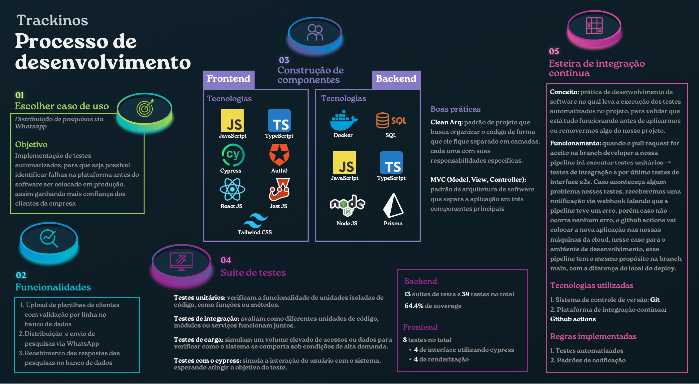
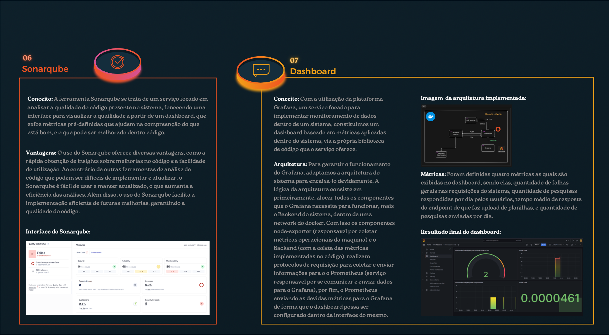

# Introdução

Este infográfico mostra de forma reduzida e sucinta como foi o processo de desenvolvimento do projeto até o final de sprint 4. Ele está dividido em 8 principais etapas.

# Infográfico

 

 

Caso as imagens não possam ser visualizadas com qualidade, acesse a versão PDF do inforgráfico: [infografico pdf](../assets/Infográfico_trackinos.pdf)