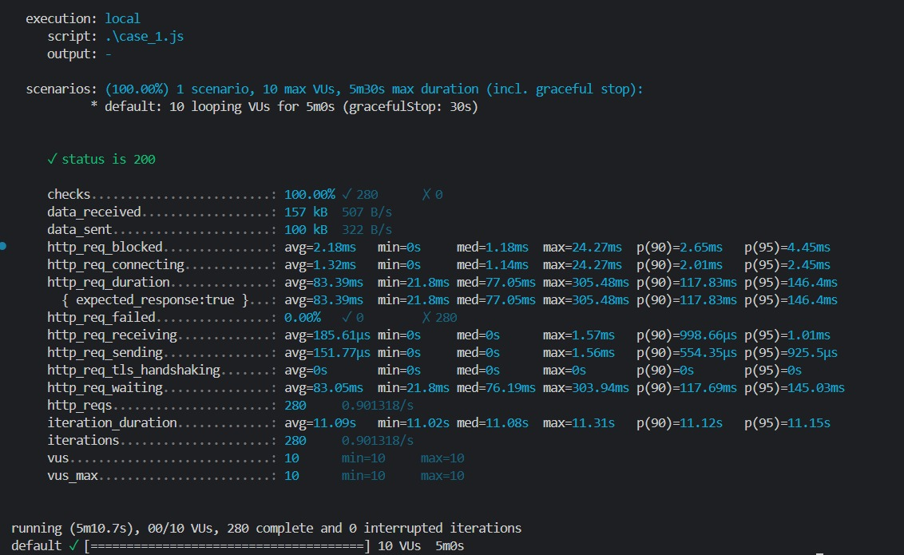

# Introdução

pequena introdução sobre o que é esse arquivo

# Plano, definição e descrição dos testes

O plano de testes é feito baseado nos requisitos escolhidos para o caso de uso inicial. Considerando isso, existem descrições dos testes tanto para o requisito um, quanto para o dois.

## Testes de unidade

Essa seção de testes de unidades tem o foco na descrição e definição dos testes de unidade dos requisitos listados no projeto. Os testes de unidade desempenham um papel fundamental na garantia da qualidade do código, pois visam verificar se cada unidade individual de código (como funções, métodos ou classes) opera conforme o esperado, isoladamente dos demais componentes do sistema. 

### Requisito funcional 1

Os testes de unidades que serão tratados fazem parte do envio da pesquisa dos clientes, os quais podem ser 3:
- Upload da lista de clientes do qual enviaremos a pesquisa;
- Enviar a pesquisa para os clientes, retornando para o usuário que a pesquisa foi enviada corretamente;
- Acessar o resultado da pesquisa;

O objetivo desses será testar de forma unitária cada etapa desse processo, garantindo seu funcionamento. Caso ele não funcione, é esperado um retorno com o erro ocorrido para ser possível tomar uma providência. 

O primeiro teste unitário a ser realizado envolve o carregamento da lista de clientes no sistema para o envio da pesquisa. O dado de entrada para este teste é a tabela pré-existente na plataforma, contendo as informações dos clientes. O resultado esperado é uma mensagem de confirmação indicando que o upload da tabela foi concluído com sucesso. Este teste é crucial para assegurar que o sistema seja capaz de processar adequadamente o upload de uma tabela contendo dados dos clientes. Esse procedimento é fundamental para o fluxo do sistema, permitindo que, após o envio da pesquisa, o usuário possa eventualmente acessar o painel de controle (dashboard) e visualizar os resultados. Esta etapa garante a integridade do processo inicial de coleta de dados até a disponibilização de insights através do dashboard, assegurando uma experiência eficaz e fluida para o usuário.

O terceiro teste unitário se diz a respeito da funcionalidade de acessar o resultado da pesquisa. O input será verificar se o sistema está recebendo o dados das pesquisas e o output será os dados de forma atualizada, o objetivo deste teste e garantir que os usuários tenham os dados atualizados  sobre as pesquisas das quais eles fizerem, para que possam analisá-las e então tomar decisões em cima de suas pesquisas feitas.

### Requisito funcional 2

O teste de unidade que iremos tratar, será, na parte de visualização dos resultados das pesquisas na plataforma:
- Selecionar uma pesquisa para ver o deshboard dela.

O objetivo desse teste será testar de forma unitária a funcionalidade de acessar o dashboard de uma única pesquisa, garantindo seu funcionamento, caso ele não funcione é esperado um retorno com o erro ocorrido para ser possível tomar uma providência. O input seria a escolha de ver uma pesquisa, ativando essa função por meio do clique em cima dela. O output seria a tela de dashboard singular que apareceria na tela.

### Tabela de inputs e outputs dos testes

| Requisito | Teste | Input | Output | Descrição |
|------------|-------|-------|--------|------------|
| Eu, como usuário, devo ser capaz de verificar os resultados das pesquisas na plataforma. | Selecionar uma pesquisa para ver o dashboard dela. | Escolha de uma pesquisa por meio do clique. | Página de dashboard da pesquisa escolhida contendo NPS e as outras métricas. | O teste se trata de acessar o dashboard de uma pesquisa única no sistema para que o usuário possa ter insights sobre cada pesquisa individualmente. |
| Eu, como funcionário, devo ser capaz de enviar as pesquisas aos meus clientes selecionados via Whatsapp, para entender o quão satisfeitos os meus clientes estão com a empresa. | Upload da lista de clientes do qual enviaremos a pesquisa. | Tabela pré-existente na plataforma preenchida com as informações dos usuários que a pesquisa será enviada. | Mensagem de confirmação falando que o upload foi realizado. | O teste garante a integridade do processo inicial de coleta de dados até a disponibilização de insights através do dashboard, assegurando uma experiência eficaz e fluida para o usuário. |
| Eu, como funcionário, devo ser capaz de enviar as pesquisas aos meus clientes selecionados via Whatsapp, para entender o quão satisfeitos os meus clientes estão com a empresa. | Enviar a pesquisa para os clientes, retornando para o usuário que a pesquisa foi enviada corretamente. | Acionamento da função de envio da pesquisa por meio de um botão na plataforma. | Alerta avisando que todas as pesquisas foram enviadas. | O teste é necessário para identificar qualquer problema no fluxo de envio do teste. |
| Eu, como funcionário, devo ser capaz de enviar as pesquisas aos meus clientes selecionados via Whatsapp, para entender o quão satisfeitos os meus clientes estão com a empresa. | Acessar o resultado da pesquisa. | Acionamento da função que recebe os dados das pesquisas. | Tela de dashboard gerada através das respostas das pesquisas. | O objetivo deste teste é garantir que os usuários tenham os dados atualizados sobre as pesquisas das quais fizeram, para que possam analisá-las e tomar decisões com base em suas pesquisas feitas. |

### Tecnologias utilizadas

**Tecnologia escolhida:** Vitest.

A tecnologia escolhida para a realização desses testes de unidade foi o Vitest, por conta da sua facilidade de utilização por conta do JS, além de trabalhar diretamente com o testes de funcionalidades unitariamente, além de ter uma CLI para nos auxiliar no desenvolvimento desses testes, nós disponibilizamos em forma de dashboard sobre as informações tiradas dos testes, como tempo de resposta, status do teste e duração do teste na totalidade.

Outra tecnologia que poderia ser usada no lugar seria o [Jest](https://jestjs.io/pt-BR/), porém ele não está trazendo certas funcionalidades de visualização após testes de forma clara ou até mesmo sem uma biblioteca a mais para o desenvolvedor.

## Testes de caixa preta

Essa seção de testes de caixa preta tem o objetivo de assegurar que as principais tarefas do sistema de testes estão funcionando da maneira como deveriam e que o usuário consegue completar a ação com facilidade. Os testes de caixa preta são essenciais para entender se as principais funcionalidades do sistema abordam todas as situações possíveis de uso além do que é esperado, já que o seu foco é no frontend e não no código em si.

### Requisito funcional 1

#### Cenário 1

Selecionar o canal de distribuição da pesquisa.

**Descrição:** Verificar se é possível selecionar o canal de distribuição Whatsapp para uma pesquisa já criada, ou seja, o usuário deve escolher em quais canais de comunicação ele quer enviar a pesquisa para seus clientes. 

**Etapas:**
1. Acesse a seção de "Pesquisas" no menu;
2. Na coluna distribuição, clique em "Não definido";
3. Selecione as opções desejadas (Whatsapp);
4. Salve sua escolha;

**Resultado Esperado:** A pesquisa que o usuário deseja distribuir deve ser entregue no canal de comunicação selecionado por ele.

#### Cenário 2 

Criar um modelo para uma planilha de clientes

**Descrição:** Avaliar se o usuário consegue criar um modelo para preencher sua planilha de clientes e acessá-la posteriormente para download e edição.

**Etapas:**
1. Acesse a seção "Clientes" no menu.
2. Esteja seguro que você se encontra na aba "modelos";
3. Clique em "Criar um novo modelo";
4. Selecione as informações que você deseja preencher sobre os seus clientes;
5. Clique em "Confirmar";

**Resultado Esperado:** O usuário deve ter um modelo personalizado para preenchimento de uma planilha, e este deve ser visualizado na plataforma.

#### Cenário 3

Importar uma planilha já existente

**Descrição:** avaliar a capacidade de editar uma pergunta já existente em uma pesquisa. Este cenário destaca a importância de permitir alterações em perguntas previamente formuladas para manter a flexibilidade no processo de coleta de feedback.

**Etapas:**
1. Acesse a seção "Clientes" no menu;
2. Esteja seguro que você se encontra na aba "planilhas";
3. Clique em "Importar planilha";
4. Selecione o arquivo desejado;
5. Se assegure que os dados estão corretos;
6. Clique em "Importar";

**Resultado Esperado:** o usuário deve ter sua planilha importada para a plataforma e essa pode ser acessada e visualizada.

### Requisito funcional 2

#### Cenário 1

Envio dos resultados da pesquisa para os clientes

**Descrição:** verificar se os resultados capturados pelo dashboard e analisados pelo time da Track.Co estão sendo enviados adequadamente para as empresas contratantes do serviço.

**Etapas:**
1. Acesso aos Resultados da Pesquisa através do envio via e-mail e SFTP;
2. Implementação de funcionalidades de filtragem, crucial para filtrar quais dados ele quer ver sobre a sua empresa;
3. Identificação de Palavras-Chave, com o intuito de entender de forma mais concisa o que é entendido da sua empresa pelos seus consumidores;

**Resultado Esperado:** 0s usuários devem ser capazes de acessar, filtrar e analisar os feedbacks de maneira eficaz, proporcionando uma compreensão aprofundada e valiosa da percepção dos clientes.

### Tecnologias utilizadas

**Tecnologia escolhida:** Cypress.

O Cypress é uma ferramenta de teste de front-end moderna e poderosa, desenvolvida em JavaScript, que permite testar de forma eficiente e confiável as funcionalidades do sistema a partir da perspectiva do usuário.

O motivo da escolha do Cypress para este projeto é sua facilidade de uso, sua capacidade de realizar testes diretamente focado no front-end da aplicação, nesse caso o ambiente onde os usuários interagem com o sistema da Track, além disso, o Cypress oferece uma interface de linha de comando (CLI) que facilita o desenvolvimento, execução e integração dos testes no processo de desenvolvimento de software.

Além de que o nosso cliente a Track.co utiliza a mesma tech para a realização de alguns testes deles, facilitando assim a entrega e a implementação do projeto no sistema deles futuramente.

## Testes de integração

Essa seção tem o objetivo verificar se os diferentes componentes ou módulos do sistema funcionam corretamente quando integrados uns com os outros. Os testes de integração são essenciais para garantir que o sistema na totalidade atenda aos requisitos de negócio e funcione de maneira correta ou esperado pelo cliente nesse caso de um software já criado e funcionando.

### Requisito funcional 1

Esse requisito tem o objetivo de realizar o envio de pesquisas via WhatsApp representando um avanço crucial para as empresas ao garantir a precisão e a eficiência na distribuição de pesquisas aos clientes.

**Processo/Endpoint:** “/sendWPP”

**Entrada:** 
Nesse endpoint espera-se o envio de certo valores para ter sucesso no seu funcionamento, sendo eles:
- ID da pesquisa;
- Clientes selecionados: [Lista de números de telefone dos clientes selecionados];
- Token de autenticação;

**Resultado Esperado:**
- Os clientes selecionados recebem a pesquisa via WhatsApp
- O sistema registra o envio da pesquisa para fins de rastreamento e relatório.

**Passos do Teste:**
1. O sistema recebe a solicitação de enviar a pesquisa via WPP para os clientes selecionados;
2. Para cada cliente na lista selecionados:
    - O sistema formata as perguntas da pesquisa em uma mensagem que seja aceita pelo WPP, como texto ou um texto com um link;
    - O sistema envia a mensagem da pesquisa para o número de telefone do cliente via API do WPP;
3. Os clientes recebem as mensagens da pesquisa em seus dispositivos ou a validação do recebimento delas;
4. Verificar nos registros do sistema se cada cliente foi marcado como tendo recebido a pesquisa;

**Observação:** este teste pressupõe que os clientes selecionados tenham o número de telefone válidos e que o sistema tem a acesso à API do WhatsApp para enviar mensagens.

### Requisito funcional 2

Esse requisito tem o objetivo de permitir a  visualização de como foram os resultados das pesquisas na totalidade, trazendo métricas como, NPS (Net Promoter Score), CSAT (Customer satisfaction) e o CES (Customer Effort Score).

**Processo/Endpoint:** “/dashboard”

**Entrada:**
Nenhum dado de entrada é necessário para este teste.

**Resultado Esperado:**
- Os resultados das pesquisas são apresentados de forma clara e compreensível para os usuários;
- Os valores de retorno devem estar de forma coerente para o Frontend;
- Métricas como NPS, CSAT e CES são calculadas com precisão e exibidas corretamente;
- Os dados são atualizados em tempo real ou conforme agendado, refletindo as pesquisas mais recentes;

**Passos do Teste:**
1. O usuário acessa a funcionalidade de visualização de resultados de pesquisas no sistema;
2. O sistema busca os dados das pesquisas realizadas, incluindo as respostas dos clientes e as métricas relevantes (NPS, CSAT, CES);
3. O sistema calcula as métricas NPS, CSAT e CEScom base nas respostas das pesquisas;
4. Os resultados das pesquisas e as métricas calculadas são apresentados na interface do usuário de forma clara e organizada;
5. Verificar se as métricas calculadas estão corretas, conforme esperado com base nas respostas das pesquisas;
6. Verifique se os dados são atualizados corretamente conforme novas pesquisas realizadas;

**Observações:**
- Este teste pressupõe que o sistema tenha acesso aos dados das pesquisas .
- A precisão das métricas é crucial para a tomada de decisões informadas com base nos resultados das pesquisas

### Tecnologias utilizadas

**Tecnologias escolhidas:** Cypress, Postman, Testing Library, Supertest.

- **Cypress:** 

Nessa situação de teste de integração o Cypress se encaixa no contexto de realizar as ações no front-end com um certo nível de integração não talvez diretamente com a API final, porém com os seus retornos que esperamos que tenha, logo o Cypress vai nos ajudar a ver se o envio e o recebimento da API está conforme o esperado.

- **Postman:**

O Postman é uma ferramenta essencial para testar e validar APIs, tornando-se uma escolha natural para testes de integração, possibilitando nós desenvolvedores a enviar solicitações HTTP para as APIs do sistema da Track.co ou para a nossa focada nas principais funcionalidades, verificando assim se elas respondem conforme o esperado e validar a integração entre os diferentes serviços ou componentes.

Nós possibilitando o salvamento de como chamar as rotas, configurar variável de ambiente e até mesmo automatizar testes diretamente pelo postman, além de conseguirmos adquirir métricas sobre tempo de resposta e a quantidade de dados transitados entre os sistemas.

Por esses motivos decidimos escolher o Postman invés do Insomnia, pois o Insomnia não possue uma ligação de criação de times e workspaces como o Postman, além de o Postman ter uma ideia para quando for trabalhar com uma equipe.

- **Testing Library:**

O Testing Library é uma ferramenta de testes focado em visualizar a renderização de certos componentes no front-end, nesse caso temos uma aplicação front-end que mesmo tendo verificado a volta dos valores não conseguimos validar se tal componente ou conteúdo HTML está sendo mesmo mostrado em tela, nesse caso o Testing Library nós permitimos validar essa renderização para o usuário final.

Garantido assim que após a validação da vinda dos valores da API temos como fazer os testes para verificar a renderização por parte do cliente, ou do usuário da aplicação.

Escolha de preferência, pois ela tem suporte para vários tipos de framework para front-end, como React, Angular, Vue, Svelt, etc. Facilitando assim a utilização por parte dos desenvolvedores da Track caso ainda queiram utilizar essa ferramenta no dia a dia do desenvolvimento e testes de novas funcionalidades.

- **Supertest:**

O Supertest é uma biblioteca popular para testar APIs HTTP em aplicativos Node.js. Ele fornece uma interface simples e fluente para fazer solicitações HTTP e validar as respostas recebidas, tornando-se uma escolha ideal para testes de integração em aplicativos Node.js.

Nós escolhemos o Supertest devido à sua integração perfeita com aplicativos Node.js e sua capacidade de realizar testes de integração de ponta a ponta em nossas APIs. Com o Supertest, podemos simular solicitações HTTP para nossos endpoints de API, verificar se as respostas estão conforme o esperado e garantir que a integração entre os diferentes serviços ou componentes esteja funcionando corretamente.

Além disso, o Supertest nos permite automatizar nossos testes de integração, o que é fundamental para garantir a consistência e a confiabilidade de nossos sistemas. Podemos escrever scripts de teste para verificar cenários comuns, como autenticação de usuário, manipulação de dados e validação de entrada, garantindo que nossa API esteja funcionando conforme o esperado em diferentes situações.

## Testes de carga

Essa seção pretende deixar de forma clara quais serão os objetivos de teste de carga especificamente no hotpath, pois além de serem funcionalidades importantes para o sistema e para as regras de negócio, além de conseguir visualizar e ver o comportamento do sistema em condições de carga diferentes.

### Requisito funcional 1

O teste de carga para o requisito um será feito em cima do envio de pesquisas aos clientes, do qual o "hotpath" é o processamento da base de clientes para enviar a pesquisa aos clientes. O objetivo do teste será realizar uma simulação de um grande processamento de dados de clientes, a qual irá auxiliar a medir o desempenho e tempo de resposta do sistema de envio de pesquisas da Track.co, com foco no processamento dos dados das planilhas de clientes feitas pelo usuário.

Considerando isso, podemos avaliar dois cenários de carga, sendo o primeiro focado em testar o desempenho da aplicação ao enviar uma pesquisa para muitos clientes de uma planilha, e o segundo, uma simulação do desempenho do sistema em dias de estabilidade e pico. A Track.co atende tanto a pequenas quanto a grandes empresas, portanto, pensando em casos extremos, o sistema precisa sempre ter capacidade de processar planilhas de clientes com facilidade e de maneira rápida, e por isso foi estipulado uma capacidade de processamento para uma planilha de 100 mil a 500 mil linhas. Além disso, para garantir uma boa experiência do usuário, mas considerando o volume de dados, o sistema deve retornar que a pesquisa foi enviada com sucesso para todos os clientes entre 5 min e 10 min depois de tal funcionalidade ser acionada.

Para o segundo cenário de teste, que tem o foco em testar o desempenho do sistema em dias de pico, foi pensado em simular casos que refletem a realidade. Pensando em primeiro lugar em um dia de estabilidade do sistema, a ideia é usar a média de pesquisas enviadas por hora, e simular um valor diretamente proporcional em um período menor. Por sua vez, o teste de carga para simular dias de pico, será feito a partir do maior ápice de usuários registrados, e definindo um período curto, de maneira a qual possamos medir as variações do servidor nesse cenário. 

### Requisito funcional 2

O teste de carga para o requisito dois será feito em cima do filtro de pesquisas, ou seja, caso o usuário deseje visualizar os resultados de uma pesquisa específica, sendo assim, o "hotpath" é a query responsável por filtrar pesquisas. O objetivo do teste será realizar uma simulação de um fluxo de clientes em dias de estabilidade e dia de pico, tomando como base a média de usuários diariamente e um ápice de usuários registrados, a partir desses volumes, podemos medir a estabilidade do banco de dados ao realizar filtragens e dados, podendo estabelecer uma linha a qual a quantidade de usuários começa a afetar a estabilidade. 

Considerando isso, pode-se estipular diversos fatores que podem ser vistos como ponto de melhora, em caso de falha, por exemplo, caso o banco de dados acabe por falhar, em meio ao processo de filtragem, pode-se considerar recursos como balanceador de carga, dentro da arquitetura. De maneira geral, esse teste de carga tem como principal objetivo identificar componentes falhos dentro da arquitetura, e atribuir elementos que garantem a eficiência e disponibilidade.

### Tecnologias utilizadas

**Tecnologia escolhida:** K6.

Para finalizar, foi decidido utilizar o framework K6 para a realização dos testes, o mesmo se alinha diretamente com as linguagens de programação previamente definidas (no caso JavaScript), além de atender de maneira objetiva todos os requisitos que definimos como necessidade para os testes.

Com ele é possível realizar diferentes formatos de testes de carga, como de 1 a x usuários simultâneos acessando tal rota, conseguindo assim fazer testes robustos com a nossa aplicação, principalmente a API, além de conseguir tirar métricas de tempo de resposta e quantidade de dados transitados.

# Resultado dos testes unitários no frontend

Nessa sessão você pode encontrar a cobertura de código que foi utilizada para fazer testes unitários em componentes do front-end, também os resultados dos testes em questão. Os resultados dos testes são atualizados por sprint, então o que for apresentando no documento corresponde a ultimo teste realizado na sprint anterior. 

Todos os testes foram realizados com auxilio da bilioteca "react-testing-libary". O manual de execução dos testes está datado no arquivo "arquitetura.md"

## Teste unitário do componente clientsTable:
Código:


Resultado: 


## Teste unitário do componente Navbar:
Código:

Resultado: 


## Teste unitário do componente SatisfactionSurveyTable:
Código:

Resultado: 
<br>


## Teste unitário do componente Modal:
Código: <br/>

Resultado:<br/>


## Conclusão dos testes

Com o resultado dos testes em vista, pode-se verificar que a renderizalção dos componentes dentro dos testes está sendo falha, com a origem desse problema ainda a ser verifica na próxima sprint. Contudo, pode-se destar a eficiência da biblioteca em realizar testes rapidos, que não ultrapassam a marca de 12 segundos.

## Execução dos testes

Para executar os testes unitários realizados, acesse a sessão [Instruções de execução testes unitários](arquitetura.md#instruções-de-testes) na documentação da arquitetura do projeto.

# Resultado dos testes de caixa preta com Cypress

Ao total, foram realizamos 4 testes do front-end. Os arquivos de teste podem ser encontrados no diretório:

~~~
2024-T0003-ES09-G03\codigo\frontend\cypress>
~~~

Os arquivos dos testes em questão são:

1. distribuicao.spec.cy.ts
2. import_sheets.cy.ts
3. spec.cy.ts
4. updateUser.spec.cy.ts

As instruções para execução dos testes de Cypress estão descritas no arquvo arquitetura.md

## Análise dos resultados

Tivemos para essa sprint um resultado de 75% nos testes, com 3 dos 4 testes passando, a seguir, o relatório de teste de cada um dos arquivos mencionados anteriormente

1. distribuicao.spec.cy.ts:


2. import_sheets.cy.ts:


3. spec.cy.ts:


4. updateUser.spec.cy.ts:


Por fim, o Cypress oferece uma visualização geral dos testes, a próxima imagem representa os resultados gerais dos testes nessa sprint:


## Execução dos testes

Para executar os testes de caixa preta realizados, acesse a sessão [Instruções de execução testes de caixa preta](arquitetura.md#instruções-para-a-execução-de-testes-de-caixa-preta) na documentação da arquitetura do projeto.

# Resultado dos testes de carga com k6

Os testes de carga no projeto foram realizados com o uso da ferramenta de código K6, que tem como foco a realização dos testes de carga. Para a configuração do teste, podem ser alteradas as variáveis "vus", que define a quantidade de usuários que serão simulados no teste de carga, e também a variável "duration", que define durante quanto tempo a simulação será realizada.
Para executar os testes, acesse o terminal, no diretório onde o arquivo de teste de encontra, e realize o seguinte comando:

```bash
k6 run .\arquivo_de_teste
```

## Endpoint de recebimento de respostas

### Cenário 1: 10 usuários, 5 minutos


</br>

- Descrição:
    - Desempenho:
        - Tempo Médio de Resposta: O tempo médio de resposta foi de 83.89ms, tendo variado entre 21.8ms e 305.45ms, podendo ser enquadrado como um tempo de resposta rápido.
        - Tempo de Espera: A média do tempo de espera das requisições foi de 83.05ms 
    - Conectividade:
        - Tempo Bloqueado: O tempo bloqueado foi de 2.18ms, que pode ser considerado, indicando eficiência em realizar conexões
        - Tempo de Conexão: O tempo de conexão foi igualmente baixo, sendo apenas de 1.32ms, indicando uma incialização das conexões rápidas e eficiêntes.
    - Volume de dados: 
        - Dados Recebidos e Enviados: O voulume de dados não pode ser considerado tão significativo, visto que é uma carga baixa para um tempo longo, tendo enviado 157kb e recebido 100kb.
    - Carga de trabalho:
        - Requisições por Segundo: 0.901318/s

    - Análise geral: Os resultados indicam que API é estavel de forma geral.
    - Recomendações: Nada a acrescentar, visto o 100% de êxito

### Cenário 2: 100 usuários, 5 minutos


</br>

- Descrição:
    - Desempenho:
        - Tempo Médio de Resposta: O tempo médio de resposta foi de 201.28ms, tendo variado entre um minimo de 18.07ms e uma maxima de 2.57s, de maneira geral foi uma média boa, mas há espaço para melhoras
        - Tempo de Espera: A média do tempo de espera das requisições foi de 200.95ms
    - Conectividade:
        - Tempo Bloqueado: O tempo de bloqueio desse cenário foi de 199.3µs, tempo que pode ser considerado extremamente baixo, apresentando a melhor eficiência até então.
        - Tempo de Conexão: Outro tempo extremamente baixo foi apresentado, com o tempo de conexão sendo apenas de 25.35µs, indicando novamente eficiência extrema nas realizações de conexões. 
    - Volume de dados: 
        - Dados Recebidos e Enviados: De maneira geral, apesar de não ser um nivel de carga absurdo, para o contexto da aplicação, esse teste pode ser considerado de alto volume, nesse cenário foi enviado 8.6mb e recebido 5.5mb.
    - Carga de trabalho:
        - Requisições por Segundo: 40.843581/s
    - Análise geral: Esse cenário demonstra que API é confiavel para realizar requisições de um volume além do esperado.
    - Recomendações: Nada a acrescentar, visto o 100% de êxito

### Cenário 3: 1.000 usuários, 15 minutos


</br>

- Descrição:
    - Desempenho:
        - Tempo Médio de Resposta: Para esse cenário, houve um aumento consideravel do tempo de resposta, tendo uma média de 3.62s, mas o que chama atenção é a maxima de demora para realizar uma requisição, que foi 43.74s, indicando problemas quando há um aumento do fluxo dos usuários
        - Tempo de Espera: A média geral do tempo espera das requisições foi de 3.6s, 
    - Conectividade:
        - Tempo Bloqueado: O tempo bloqueado foi de 49.25ms, que foi um tempo mais alto que os cenários anteriores, mas de maneira geral, ainda apresenta certa eficiência ao realizar requisições.
        - Tempo de Conexão: O tempo de conexão támbem foi maior que os cenários anteriores, sendo de 46ms, que novamente, apesar de mais alto, de maneira geral, ainda sim representa certa eficiência na realização e incialização das conexões
    - Volume de dados: 
        - Dados Recebidos e Enviados: Novamente, não é um cenário de volume extremo, mas para o contexto da aplicação pode ser considerado alto, o envio foi de 14mb e o recebimento de 17mb. 
    - Carga de trabalho:
        - Requisições por Segundo: 86,009155/s 
    - Análise geral: O teste demonstra que um volume de dados usuário alto em um tempo moderado, pode apresentar falta de confiabilidade da API
    - Recomendações: Implementar um sistema de filas para que haja melhoras nos cenários com tempo de requisições menor

### Cenário 4: 10.000 usuários, 15 minutos


</br>

- Descrição:
    - Desempenho:
        - Tempo Médio de Resposta: O tempo médio de respostas aumentou novamente, tendo tido uma média de 6.86s, tendos minimas e maximas bem distantes entre si, de maneira geral, há espaços para melhores mas foram resultados decentes.
        - Tempo de Espera: O tempo de espera das requisições teve uma média de 6.83s
    - Conectividade:
        - Tempo Bloqueado: Para esse cenário, houve um aumento consideravel, tendo de bloqueado 84.33ms, indicando espaços para melhora nesse caso, mas ainda mostranto efetividade das conexões de forma geral.
        - Tempo de Conexão: Novamente um aumento consideravel, tendo 78.33ms, podendo ser melhorado mas ainda sim, indicando certo êxito nas conexões de forma geral.
    - Volume de dados: 
        - Dados Recebidos e Enviados: Esse cenário apresenta uma carga enorme, sendo um teste de extremo estresse na API, tendo enviado 17mb e recebido 13mb.
    - Carga de trabalho:
        - Requisições por Segundo: 154.854027/s 
    - Análise geral: Esse cenário demonstra que a API não reage muito bem a testes extremos.
    - Recomendações: Implementar um sistema de filas para que haja melhoras nos cenários com tempo de requisições menor

### Cenário 5: 1.000 usuários, 30 minutos


</br>

- Descrição:
    - Desempenho:
        - Tempo Médio de Resposta: O tempo médio de resposta foi muito acima do esperado, tendo uma média de 9.41s, que é considerado bem alto para os parametros do teste.
        - Tempo de Espera: O tempo de espera aumentou para 9.41s, se mantendo relativamente proporcional ao tempo médio de respostas.
    - Conectividade:
        - Tempo Bloqueado: Nesse cenário tivemos melhoras absurdas, com um tempo de 609.85µs, tempo extremamente rápido.
        - Tempo de Conexão: Melhora absurda nesse quesito, tendo um tempo de conexão de 495.92µs, indicando extrema eficiência nas incializações das conexões
    - Volume de dados: 
        - Dados Recebidos e Enviados: Esse teste apresenta uma cenário de carga muito baixo, mas que para o contexto da aplicação, pode ser considerado uma carga que se esperaria nesse periodo de tempo, tendo um envio de 82mb e um recebimento de 53mb.
    - Carga de trabalho:
        - Requisições por Segundo: 87.014205/s
    - Análise geral: Uma demonstração boa de que a API aguenta um alto volume de dados, mas em um cenário em que o tempo de requisição é alto. 
    - Recomendações: De maneira geral, 92.75% de êxito, pode-se pensar em estrategias para atingir o 99%, mas creio que esse cenário não precise de alterações no sistema. 

### Cenário 6: 10.000 usuários, 30 minutos


</br>

- Descrição:
    - Desempenho:
        - Tempo Médio de Resposta: O tempo médio de respostas se manteve e foi de 9.14s, o que indica algo positivo, visto que a quantidade de usuários aumentou.
        - Tempo de Espera: O tempo de espera se manteve na linha de 9.13s, e novamente isso é positivo dado que o numero de usuários aumentou.
    - Conectividade:
        - Tempo Bloqueado: Um tempo muito bom foi apresentado nos resultados, com apenas 6.27ms, indicando uma grande eficência nas realizações de conexões.
        - Tempo de Conexão: O tempo de conexões foi baixissímo, sendo apenas de 4.84ms, apresentando ótima eficiência.
    - Volume de dados: 
        - Dados Recebidos e Enviados: De maneira geral, para o contexto da aplicação, esse cenário apresenta uma carga muito alta, mas que ainda sim pode-se considerar significativa em relação ao funcionamento da API, o envio foi de 69mb e o recebimento de 48mb. 
    - Carga de trabalho:
        - Requisições por Segundo: 152.989863/s 
    - Análise geral: Novamente mostrando que a API aguenta um grande volume de requisições, mas se for dentro de um espaço de tempo alto.
    - Recomendações: Esse cenário precisa de melhoras, possivelmente a implementação de um sistema de filas, visto que o processamento de usuário tende a melhorar.

## Endpoint de upload de planilhas

### Cenário 1: 10 usuários, 5 minutos

Foram realizados 2 testes com o endpoint de pesquisas, um com uma planilha de 10.000 usuários, e outra com 1.000, para observar se existe alguma diferença. Além disso, vale ressaltar que esse endpoint acessa as planilhas localmente, o que justifica o os números do volume de dados enviados.

O resultado dos testes pode ser visto abaixo:

Teste com planilha de 10.000 usuários:


</br>

**Descrição dos resultados:**
- Desempenho:
    - Tempo médio de resposta: a requisição durou menos de 2 segundos, o que é um resultado bom, considerando a quantidade de informações a serem processadas no banco de dados
    - Tempo de espera: o tempo de espera pelo usuário foi o mesmo de resposta, sendo 1.78 segundos, que é relativamente rápido considerando o contexto.

- Conectividade:
    - Tempo bloqueado e tempo de conexão: os valores médios foram de 134.82µs para tempo bloqueado e 92.01µs para tempo de conexão. Esses tempos são muito baixos, indicando eficiência na rede e na inicialização das conexões.

- Volume de dados: 
    - Dados recebidos e enviados: a primeira vista, pode parecer que a API processou um número significante de dados, já que que recebeu 8.4kb e enviou 7.9kb, porém, a requisição não está enviando a planilha, pois esta está sendo acessada localmente. Com isso, o volume de dados da requisição se torna uma métrica não relevante nesse caso.

- Carga de trabalho:
    - Requisições por segundo: a taxa foi de 0.060606/s, com 20 iterações completas, o que demonstra que o sistema não foi capaz de lidar com a carga, e por isso o tempo foi baixo, já que só concluiu 20 interações.

- Análise geral: como é possível perceber, o teste falhou 90%, com apenas 3 de 30 usuários que realizaram a requisição com sucesso. Além disso, a métrica de carga de trabalho não teve um resultado satisfatório, já que as requisições do teste mal foram processadas. A explicação mais detalhada do resultado e qual a possível solução para resolver o problema está descrita em __"Conclusão e recomendações"__ no final da sessão.

Teste com planilha de 1.000 usuários:


</br>

**Descrição dos resultados:**
- Desempenho:
    - Tempo médio de resposta: considerando a quantidade baixa de dados, o fato da requisição ter durado 186.61ms é um resultado muito bom, já que o tempo é extremamente baixo.
    - Tempo de espera: o tempo de espera da requisição pelo usuário fo ide 186.51ms, o que também é um tempo extremamente baixo.

- Conectividade:
    - Tempo bloqueado e tempo de conexão: os valores médios foram de 169.42µs para tempo bloqueado e 98.34µs para tempo de conexão. Esses tempos são muito baixos, indicando eficiência na rede e na inicialização das conexões. Além disso, os tempos foram maiores do que o teste de cima, uma vez que por ser uma quantidade menor de dados, ele conseguiu processar mais requisições.

- Volume de dados: 
    - Dados recebidos e enviados: a primeira vista, pode parecer que a API processou um número significante de dados, já que que recebeu 8.1kb e enviou 7.9kb, porém, a requisição não está enviando a planilha, pois esta está sendo acessada localmente. Com isso, o volume de dados da requisição se torna uma métrica não relevante nesse caso.

- Carga de trabalho:
    - Requisições por segundo: a taxa também foi de 0.060606/s, e também concluiu apenas 20 iterações, o que demonstra que o sistema não foi capaz de lidar com a carga, e por isso o tempo foi baixo.

- Análise geral: como é possível perceber, o teste falhou em torno de 73%, com apenas 8 de 30 usuários que realizaram a requisição com sucesso, o que já é um resultado melhor que o anterior, mas ainda não está dentro das expectativas. A explicação mais detalhada do resultado e qual a possível solução para resolver o problema está descrita em __"Conslusão e recomendações"__ no final da sessão.

**Conclusão e recomendações:**
Como foi possível analisar, o sistema performou um pouco melhor com uma quantidade menor de usuários a serem inseridos no banco, mas ainda assim, o resultado foi muito abaixo do esperado para ambos os casos. Isso ocorreu, porque atualmente o sistema não está serial, ou seja, ele não tem a capacidade de realizar o processo de relação entre o "Customer" e a "Company" ao mesmo tempo que outros usuários estão subindo novas bases de dados. Pensando nisso, algo que melhoraria o resultado seria a implementação de filas, pois ela permite que o processo de criar uma relação seja processada um de cada vez, sendo assim, o sistema processaria apenas uma base de dados por vez.

O código dos testes pode ser encontrado em: 

```
./codigo/backend/src/scripts/load/uploadFile/load-upload-file.js
```

## Endpoint de get de usuários

### Cenário 1: 10 usuários, 5 minutos


</br>

- Descrição:
    - Desempenho:
        - Tempo Médio de Resposta: O tempo médio de resposta foi de 11.97ms
        - Tempo de Espera: O tempo de espera foi de 11.62ms (http_req_waiting)
    - Conectividade:
        - Tempo Bloqueado: O tempo bloqueado foi de 1.91ms 
        - Tempo de Conexão: O tempo de conexão foi de 1.38ms 
    - Volume de dados: 
        - Dados Recebidos e Enviados: A API processos 244kB de dados recebidos e 50kB de dados enviados 
    - Carga de trabalho:
        - Requisições por Segundo: A taxa de requisições foi de 0.99804/s
    - Análise geral: 
        A API testada está se comportando de maneira excelente, com tempos de resposta e espera muito baixos, o que é indicativo de uma API bem otimizada e com bom desempenho sob as condições testadas.
    - Recomendações: 
        - Monitorar as respostas da API a diferentes cargas vai ajudar a identificar pontos de saturação ou falhas potenciais.

### Cenário 2: 100 usuários, 5 minutos


</br>

- Descrição:
    - Desempenho:
        - Tempo Médio de Resposta foi de 27.27 ms em média.
        - Tempo de Espera foi de 26.96ms, quase igual ao tempo médio de resposta, o que indica que a maior parte do tempo de resposta é de fato o servidor processando a requisição.

    - Conectividade:
        - Tempo Bloqueado foi de 1.37ms mostrando que não há atrasos significativos antes do envio das requisições.
        - Tempo de Conexão foi de 1.12ms indicando que a API pode estabelecer uma conexão com o servidor quase instantaneamente. 

    - Volume de dados: 
        - Dados Recebidos e Enviados:  Foram recebidos 2.4 MB e enviados 498 kB de dados. Este é um volume maior de dados recebidos em comparação ao teste anteriore, indicando que a API pode lidar bem com uma quantidade maior de dados.

    - Carga de trabalho:
        - Requisições por Segundo: A taxa de requisições por segundo foi de 9.963793/s 

    - Análise geral: A API testada parece ter um bom desempenho, lidando com uma carga de trabalho consideravelmente mais alta e um maior volume de dados do que o teste anterior, apesar de um aumento nos tempos de resposta e de espera.
    - Recomendações: 
        - Avaliar o desempenho sob diferentes condições de rede para assegurar que a latência não afete negativamente a experiência do usuário.
        - Realizar testes de stress para determinar o ponto de ruptura da API.

### Cenário 3: 1.000 usuários, 15 minutos


</br>

- Descrição:
    - Desempenho:
        - Tempo Médio de Resposta é de 58.47 ms. O valor máximo de 777.58 ms pode indicar variações ou picos na resposta da API sob determinadas condições.
        - Tempo de Espera foi de 58.13ms está alinhado com o tempo médio de resposta, o que sugere que a maior parte do tempo de resposta é devido ao processamento no servidor.
    - Conectividade:
        - Tempo Bloqueado foi de 2.05ms.
        - Tempo de Conexão é de 1.92ms.
        Indicando que não tem atrasos significativos de rede ou de disponibilidade do servidor.
    - Volume de dados: 
        - Dados Recebidos e Enviados: A API processou 72MB de dados recebidos e 15MB de dados enviados. Esta é uma quantidade substancial que sugere capacidade de lidar com cargas de dados significativas.
    - Carga de trabalho:
        - Requisições por Segundo: A taxa de rquisições por segundo foi de 99.876393/s. Sustentando uma alta taxa de requisições por segundo.
    - Análise geral: 
        - A API parece ter um desempenho estável e é capaz de lidar com uma quantidade significativa de dados e um alto número de requisições. No entanto, a presença de algumas requisições com tempos de resposta mais altos sugere que podem existir pontos de ineficiência que devem ser investigados.
    - Recomendações: 
        - Analisar os logs de desempenho para entender as causas dos tempos de resposta mais altos e se eles estão concentrados em certos tipos de requisições ou em momentos específicos.

### Cenário 4: 10.000 usuários, 15 minutos


</br>

- Descrição:
    - Desempenho:
        - Tempo Médio de Resposta é de aproximandamente 306.66 ms.
        -  O tempo médio de espera é de cerca de 299.3 ms. Esse valor é um indicativo da latência do servidor após a conexão ter sido estabelecida.
    - Conectividade:
        - Tempo Bloqueado em média foi de 1.55 ms, significando que não há atrasos antes do início das requisições.
        - Tempo de Conexão é de aproximadamente 1.48ms,  indicando que a conexão com o servidor é rápida.
    - Volume de dados: 
        - Dados Recebidos e Enviados: A API processou um volume significativo de dados, com aproximadamente 73 MB recebidos e 19 MB enviados. Essa é uma quantidade substancial, mostrando que a API pode lidar bem com grandes transferências de dados.

    - Carga de trabalho:
        - Requisições por Segundo: A taxa está em aproximadamente 596.34163/s, o que demonstra uma alta capacidade de throughput e indica que a API pode manejar um número elevado de requisições simultâneas. 

    - Análise geral: Os resultados indicam que a API testada apresenta um desempenho robusto e confiável. As respostas rápidas e os tempos de conexão baixos são indicativos de uma boa otimização e recursos de hardware adequados.
    - Recomendações: 
        - Pode ser útil também analisar os tempos de espera específicos para endpoints individuais para identificar possíveis gargalos.

### Cenário 5: 1.000 usuários, 30 minutos


</br>

- Descrição:
    - Desempenho:
        - Tempo Médio de Resposta: A média pe de 41.15 ms, isso pode indicar que estamos processando muitas solicitações.
        - Tempo de Espera: A média é de 40.68 ms o que indica que o processamento no servidor é o principal componente do tempo de resposta.
    - Conectividade:
        - Tempo Bloqueado é de 1.38 ms.
        - Tempo de Conexão é de 1.29ms.
        Ambos os tempos são muito baixos indicando que a API não está enfrentando atrasos significativos na rede.
    - Volume de dados: 
        - Dados Recebidos e Enviados: A API processou um volume significativo de dados, com 138 MB recebidos e 28 MB enviados
    - Carga de trabalho:
        - Requisições por Segundo: A taxa de 94.619125/s 
    - Análise geral: 
        A API parece estar lidando bem com o volume de dados e conectividade, mas o tempo de resposta mais alto e a presença de falhas indicam áreas que podem requerer atenção e possível otimização.   
     - Recomendações: 
        - Investigar as causas das falhas para identificar se elas são devido a picos de carga, problemas específicos de endpoint ou limitações da infraestrutura.

       - Considerar estratégias para reduzir o tempo médio de resposta, como otimização de código, melhorias na infraestrutura ou escalabilidade horizontal.

### Cenário 6: 10.000 usuários, 30 minutos


</br>

- Descrição:
    - Desempenho:
        - Tempo Médio de Resposta: 0 ms, o que indica que as requisições foram processadas instantaneamente ou que houve um erro no registro do teste, pois é improvável que o tempo de resposta seja zero.
        - Tempo de Espera é de 0 ms.
    - Conectividade:
        - Tempo Bloqueado: 0 ms.
        - Tempo de Conexão: 0 ms.
    - Volume de dados: 
        - Dados Recebidos e Enviados: 0 B recebidos e enviados. A falta de dados transferidos reforça a possibilidade de um erro no teste.
    - Carga de trabalho:
        - Requisições por Segundo: A taxa de 989.369548/s. O que é extraordinariamente alto que, combinado com os outros resultados anômalos, sugere um problema no registro do teste

    - Análise geral: É provável que haja um erro nos resultados deste teste, pois os tempos de resposta e o volume de dados não são realistas.

    - Recomendações: 
        - Verificar a configuração do teste para garantir que os dados sejam coletados corretamente.
        - Re-executar o teste para obter resultados precisos e viáveis.

## Endpoint de distribuição

### Cenário 1: 10 usuários, 5 minutos
   

</br>

- Descrição:
    - Desempenho:
        - Tempo médio de resposta: A requisição teve uma média de 1 segundo para responder, o que é satisfatório para o contexto do teste.
        - Tempo de espera: O tempo de espera para a resposta da requisição também foi de 1 segundo, indicando uma boa capacidade de resposta do sistema.
        
    - Conectividade:
        - Tempo Bloqueado  e tempo de conexão: O tempo médio de bloqueio foi de 61.64µs e o tempo de conexão foi de 15.13µs, ambos valores baixos, indicando uma eficiente conectividade e inicialização das conexões.
          
    - Volume de dados:
        - Dados recebidos e enviados: Foram recebidos 236 kB e enviados 204 kB de dados durante o teste, o que indica uma quantidade significativa de informações sendo processadas.
          
    - Carga de trabalho:
        - Requisições por segundo: A taxa de requisições por segundo foi de 2.49, com 765 requisições completadas, mostrando que o sistema foi capaz de lidar eficientemente com a carga de trabalho.
          
Análise geral: O teste foi bem-sucedido, com todas as requisições completadas com sucesso e uma boa taxa de processamento de requisições por segundo. Os tempos de resposta e de espera foram satisfatórios, indicando um desempenho aceitável do sistema sob carga.

### Cenário 2: 100 usuários, 5 minutos


</br>

- Descrição dos resultados:
    - Desempenho:
        - Tempo médio de resposta: A requisição teve uma média de duração de 6.49 segundos, o que pode ser considerado elevado, especialmente considerando o tempo máximo de 34.83 segundos.
        - Tempo de espera: O tempo médio de espera foi praticamente o mesmo que o tempo de resposta, com uma média de 6.48 segundos.

    - Conectividade:
        - Tempo bloqueado e tempo de conexão: O tempo médio de bloqueio foi de 205.05µs e o de conexão foi de 162.67µs, indicando eficiência na rede e na inicialização das conexões.
          
    - Volume de dados:
        - Dados recebidos e enviados: A requisição recebeu um volume de dados de 478 kB e enviou 423 kB, o que mostra uma quantidade significativa de dados processados.
          
    - Carga de trabalho:
        - Requisições por segundo: A taxa de requisições foi de 6.229093/s, indicando uma carga de trabalho considerável no sistema. Foram realizadas 2045 iterações completas durante o teste.

    - Análise geral: Os resultados mostram que o sistema conseguiu lidar com a carga de trabalho, apesar de alguns tempos de resposta mais elevados. No entanto, houve uma taxa de falha de 24.40% nas requisições, o que pode indicar possíveis problemas de desempenho ou de configuração. Recomenda-se uma análise mais detalhada dos tempos de resposta mais altos e uma investigação sobre as causas das falhas nas requisições.

### Cenário 3: 1.000 usuários, 15 minutos


</br>

- Descrição dos resultados:
    - Desempenho:
        - Tempo médio de resposta: A requisição teve um tempo médio de resposta de 3.36 segundos, o que pode ser considerado um pouco elevado, especialmente considerando a quantidade de usuários simulados.
        - Tempo de espera: O tempo de espera pela resposta da requisição foi o mesmo que o tempo de resposta, indicando que os usuários estão aguardando até receberem a resposta do servidor.

    - Conectividade:
        - Tempo bloqueado e tempo de conexão: Os valores médios foram de 72.16µs para o tempo bloqueado e 61.51µs para o tempo de conexão. Esses tempos são relativamente baixos, o que sugere uma boa eficiência na rede e na inicialização das conexões.
          
    - Volume de dados:
        - Dados recebidos e enviados: Durante o teste, a API recebeu um total de 6.1 MB de dados e enviou 5.6 MB. Essa troca de dados é significativa e pode indicar um processamento intenso de informações no servidor.
          
    - Carga de trabalho:
        - Requisições por segundo: O teste atingiu uma taxa média de 92.03 requisições por segundo, o que indica uma carga significativa no servidor.
        - Iterações completas: Todas as 84,092 iterações do teste foram concluídas com sucesso, o que sugere uma boa estabilidade do sistema sob carga.
          
    - Análise geral: O teste foi bem-sucedido em termos de completude das iterações, porém, o tempo de resposta um pouco elevado pode indicar uma possível necessidade de otimização do servidor para lidar com um grande volume de usuários. Recomenda-se uma análise mais detalhada para identificar possíveis gargalos no sistema e realizar otimizações conforme necessário.

### Cenário 4: 10.000 usuários, 15 minutos


</br>

- Descrição dos resultados:
    - Desempenho:
        - Tempo médio de resposta: A requisição teve um tempo médio de resposta de 3.03 segundos, o que está dentro de um intervalo aceitável considerando a carga de trabalho.
        - Tempo de espera: O tempo de espera foi praticamente o mesmo que o tempo de resposta, com uma média de 3.02 segundos, indicando uma resposta rápida do sistema.

    - Conectividade:
        - Tempo bloqueado e tempo de conexão: O tempo médio de bloqueio foi de 122.82µs e o tempo de conexão foi de 111.37µs, ambos apresentando valores baixos, o que indica uma boa eficiência na rede e nas conexões.
          
    - Volume de dados:
        - Dados recebidos e enviados: Durante o teste, foram recebidos 23 MB de dados e enviados 21 MB, com uma taxa de transferência de aproximadamente 25 kB/s para recebimento e 22 kB/s para envio.
          
    - Carga de trabalho:
        - Requisições por segundo: A taxa de requisições por segundo foi de 276.83015/s, indicando uma carga de trabalho significativa sobre o sistema, o que pode ter impactado no tempo de resposta das requisições.
          
    - Análise geral:
        - O teste foi executado com sucesso para 100% das requisições, com 72949 verificadas como bem-sucedidas e nenhuma falha registrada.
        - No entanto, 71.27% das requisições falharam durante o teste, o que indica uma possível instabilidade no sistema ou problemas de conectividade.
        - O tempo de resposta das requisições variou de forma significativa, com algumas requisições sendo processadas em menos de 2 segundos e outras demorando mais de 42 segundos.
        - Recomenda-se uma análise mais aprofundada dos resultados para identificar possíveis gargalos no sistema e realizar ajustes para melhorar o desempenho e a estabilidade das requisições.

### Cenário 5: 1.000 usuários, 30 minutos


</br>

- Descrição dos resultados do teste de carga:
    - Desempenho:
        - Tempo médio de resposta: A requisição teve um tempo médio de resposta de 7.24 segundos, o que pode ser considerado relativamente alto, indicando possíveis problemas de desempenho na aplicação.
        - Tempo de espera: O tempo médio de espera foi semelhante ao tempo de resposta, indicando que os usuários estão aguardando o retorno da requisição antes de prosseguir, o que pode impactar negativamente a experiência do usuário.

    - Conectividade:
        - Tempo bloqueado e tempo de conexão: Os valores médios foram de 99.48µs para tempo bloqueado e 84.96µs para tempo de conexão. Embora os tempos sejam relativamente baixos, indicando eficiência na rede e na conexão, podem ser otimizados para melhorar o desempenho geral.
          
    - Volume de dados:
        - Dados recebidos e enviados: Foram recebidos 17 MB e enviados 15 MB de dados durante o teste. Esses valores indicam uma carga considerável de dados, o que pode ser uma preocupação em termos de escalabilidade e uso de largura de banda.
          
    - Carga de trabalho:
        - Requisições por segundo: A taxa de requisições por segundo foi de 58.142203, o que demonstra que o sistema foi capaz de lidar com a carga de trabalho definida nos estágios do teste.
  
    - Análise geral: O teste foi concluído com sucesso, atingindo o número esperado de usuários e duração definidos nos estágios. No entanto, o tempo médio de resposta e espera indica possíveis áreas de melhoria no desempenho da aplicação. Recomenda-se uma análise mais aprofundada dos resultados para identificar e resolver quaisquer gargalos de desempenho, garantindo uma melhor experiência do usuário.

## Cenário 6: 10.000 usuários, 30 minutos


</br>

- Descrição dos resultados:
    - Desempenho:
        - Tempo médio de resposta: A média do tempo de resposta das requisições foi de 2.58 segundos, com uma distribuição que varia de 0 a 42.54 segundos. Embora a média esteja dentro de um limite razoável, a variabilidade dos tempos indica possíveis problemas de desempenho em alguns casos.
        - Tempo de espera: O tempo médio de espera pelo usuário foi o mesmo que o tempo de resposta, indicando uma resposta relativamente rápida do sistema para os usuários.

    - Conectividade:
        - Tempo bloqueado e tempo de conexão: Os valores médios foram de 129.87µs para o tempo bloqueado e 106.68µs para o tempo de conexão. Esses tempos são baixos, sugerindo uma boa eficiência na rede e na inicialização das conexões.
          
    - Volume de dados:
        - Dados recebidos e enviados: A API recebeu 40 MB e enviou 37 MB de dados durante o teste. Esses números são significativos e podem indicar uma carga substancial no sistema.
          
    - Carga de trabalho:
        - Requisições por segundo: O teste executou 736.716 requisições durante a duração total do teste, com uma taxa média de 407.613147 requisições por segundo. Isso indica uma carga considerável no sistema, especialmente durante os estágios com maior número de usuários.

    - Análise geral: O teste apresentou um alto índice de falhas, com 82.54% das requisições resultando em erro. A métrica de carga de trabalho indicou que o sistema teve dificuldade em lidar com a carga, especialmente nos estágios com maior número de usuários. Recomenda-se investigar as causas das falhas e possíveis gargalos no sistema para melhorar a sua performance e estabilidade.

## Endpoint de Update User

### Cenário 1: 10 usuários, 5 minutos

 </img>
</br>

- Descrição:
    - Desempenho:
        - Tempo Médio de Resposta (tempo médio = 80.73ms)
        - Tempo de Espera (tempo médio = 80.18 ms)
    - Conectividade:
        - Tempo Bloqueado (tempo médio = 16.3µs)
        - Tempo de Conexão (tempo médio = 1.18µs)
    - Volume de dados: 
        - Dados Recebidos e Enviados: A API processou um volume significativo de dados, com 1.3 MB recebidos e 780 kB enviados
    - Carga de trabalho:
        - Requisições por Segundo: 9.241412/s
    - Análise geral: Os resultados indicam que a API mantem um bom desempenho, com esse numero de requisições e com essse numero de ususarios, tendo um desempenho robusto e confiavel.
    - Recomendações: Sem recomendações nesse caso.

### Cenário 2: 100 usuários, 5 minutos

 </img>
</br>

- Descrição:
    - Desempenho:
        - Tempo Médio de Resposta (tempo médio = 1.65s)
        - Tempo de Espera (tempo médio = 1.65)
    - Conectividade:
        - Tempo Bloqueado (tempo médio = 23.22µs)
        - Tempo de Conexão (tempo médio = 4.89µs)
    - Volume de dados: 
        - Dados Recebidos e Enviados: A API processou um volume significativo de dados, com 5.4 MB recebidos e 3.2 MB enviados.
    - Carga de trabalho:
        - Requisições por Segundo: A taxa de 37.563418/s
    - Análise geral: Os resultados indicam que a API mantem um bom desempenho, com esse numero de requisições e com essse numero de ususarios, tendo um desempenho robusto e confiavel.
    - Recomendações: Sem recomendações nesse caso.

### Cenário 3: 1.000 usuários, 15 minutos

 </img>
</br>

- Descrição:
    - Desempenho:
        - Tempo Médio de Resposta (tempo médio = 12.71ms)
        - Tempo de Espera (tempo médio = 12.7ms)
    - Conectividade:
        - Tempo Bloqueado (tempo médio = 378.8µs)
        - Tempo de Conexão (tempo médio = 377.37µs)
    - Volume de dados: 
        - Dados Recebidos e Enviados: A API processou um volume significativo de dados, com 180 MB recebidos e 379 kB enviados.
    - Carga de trabalho:
        - Requisições por Segundo: A taxa de 984.222202/s
    - Análise geral: Os resultados indicam que a API não mantem um bom desempenho, com esse numero de requisições e com essse numero de ususarios, tendo um desempenho ruim e não confiavel.
    - Recomendações: è recomendado que faça um sistema de fila para que seja suportada essa carga de requisições.

### Cenário 4: 10.000 usuários, 15 minutos

 </img>
</br>

- Descrição:
    - Desempenho:
        - Tempo Médio de Resposta (tempo médio = 15.21ms)
        - Tempo de Espera (tempo médio = 15.15ms)
    - Conectividade:
        - Tempo Bloqueado (tempo médio = 3.77ms)
        - Tempo de Conexão (tempo médio = 3.75ms)
    - Volume de dados: 
        - Dados Recebidos e Enviados: A API processou um volume significativo de dados, com 177 MB recebidos e 2.9 MB enviados.
    - Carga de trabalho:
        - Requisições por Segundo: A taxa de 6846.194174/s
    - Análise geral: Os resultados indicam que a API não mantem um bom desempenho, com esse numero de requisições e com essse numero de ususarios, tendo um desempenho ruim e não confiavel.
    - Recomendações: è recomendado que faça um sistema de fila para que seja suportada essa carga de requisições.

### Cenário 5: 1.000 usuários, 30 minutos

 </img>
</br>

- Descrição:
    - Desempenho:
        - Tempo Médio de Resposta (tempo médio = 6.39ms)
        - Tempo de Espera (tempo médio = 991.124106/s)
    - Conectividade:
        - Tempo Bloqueado (tempo médio = 244.05µs)
        - Tempo de Conexão (tempo médio = 242.86µs)
    - Volume de dados: 
        - Dados Recebidos e Enviados: A API processou um volume significativo de dados, com 182 kB recebidos e 383 kB enviados.
    - Carga de trabalho:
        - Requisições por Segundo: A taxa de 991.124106/s 
    - Análise geral: Os resultados indicam que a API não mantem um bom desempenho, com esse numero de requisições e com essse numero de ususarios, tendo um desempenho ruim e não confiavel.
    - Recomendações: è recomendado que faça um sistema de fila para que seja suportada essa carga de requisições.

### Cenário 6: 10.000 usuários, 30 minutos

Não foi possivel executar esse teste, toda as vezes que tentamos rodar o VS Code ele encerra logo após o termino do periodo de teste, fazendo com que não fosse possivel retirar as metricas desse teste; Mas levando em consideração o que ocorreu com os ultimos testes esse teste tambem falharia e a recomendação seria similar a dos outros, que é adicionar um sistema de filas para que essa rota suporte esse numero de chamadas.

## Execução dos testes

Para executar os testes de carga realizados, acesse a sessão [Instruções de execução testes de carga](arquitetura.md#instruções-de-instalação-e-execução-dos-testes-de-carga-com-k6) na documentação da arquitetura do projeto.